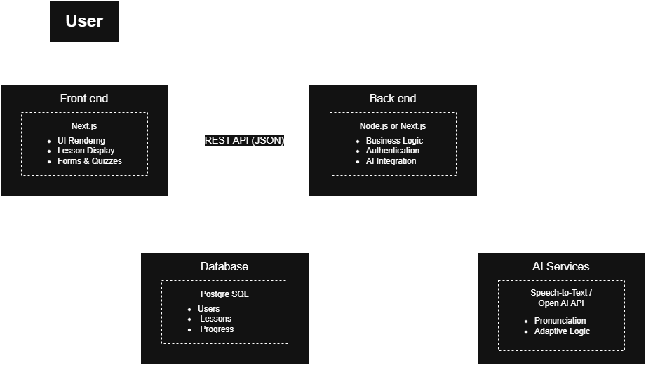

# Linguiny — AI-Powered Language Learning Platform

### COMP6703001 – Web Application Development and Security
### BINUS University International

---

## Group Information
- **Group:** Linguiny
- **Class:** L4BC
- **Members:**
  - David Nathanael Halim (2802569346)
  - Davin Alexander (2802530653)
  - Jeremy Nathanael Gunawan (2802522960)

---

## Project Information
**Project Title:** Linguiny — AI-Powered Language Learning Platform  
**Project Domain:** Language Learning Web Application

### Project Description
Linguiny is a web-based language learning application designed to help users improve their language skills through interactive lessons, quizzes, AI-powered conversations, and pronunciation practice.

The platform supports multiple languages and provides personalized learning experiences through adaptive learning mechanisms and AI-generated feedback.

---

## Architecture Design
### System Architecture
<br>
Browser (User)
    |
    | HTTPS
    ↓
Next.js App (Single Codebase)
├── Frontend (React/Tailwind — app/dashboard/**, app/login, app/register)
│   ├── AuthGuard.tsx        — Client-side route protection
│   ├── authprovider.tsx     — Firebase Auth state global context
│   └── languageprovider.tsx — Global selected language context
│
├── Next.js API Routes (app/api/**)  ← The "backend"
│   ├── /api/sync-user              — POST: Firebase → Prisma sync
│   ├── /api/users/[uid]            — GET/PUT/DELETE user (auth-protected)
│   ├── /api/users/[uid]/sessions   — GET sessions
│   ├── /api/sessions/[sessionId]   — DELETE session
│   ├── /api/lessons                — GET lessons (no auth)
│   ├── /api/lessons/[id]           — GET lesson + quiz
│   ├── /api/quiz/attempt           — POST quiz attempt (auth-protected)
│   ├── /api/quiz/attempt/[id]      — GET/DELETE attempt
│   ├── /api/quiz/attempts/[uid]    — GET user history
│   ├── /api/leaderboard            — GET leaderboard )
│   ├── /api/flashcards/[lang]      — GET flashcard deck
│   ├── /api/vocabulary/[lang]      — GET vocabulary
│   ├── /api/ai/chat                — POST: Groq conversation tutor
│   ├── /api/ai/feedback            — POST: Groq quiz feedback
│   ├── /api/ai/generate-sentence   — POST: Groq sentence generator
│   ├── /api/ai/vocabulary-example  — POST: Groq vocab example
│   └── /api/ai/adaptive-difficulty — POST: 
│
├── lib/
│   ├── security.ts     — Rate limiting, sanitizeText, sanitizeChatMessages
│   ├── firebaseAdmin.ts — Server-side token verification (getAuthenticatedUid)
│   ├── firebase.ts     — Client-side Firebase init
│   └── prisma.ts       — Prisma client singleton
│
└── middleware.ts       
    |
    ↓
External Services
├── Firebase Auth       — User identity, Google OAuth, email/password
├── Firebase Firestore  — User profile data (XP, streak, goals, dailyGoals)
├── PostgreSQL (Prisma) — Users, Sessions, Accounts, QuizAttempts, QuizAnswers
└── Groq API (Llama 3.3 70B) — All AI features
#### Frontend
- Next.js
- React
- Tailwind CSS

#### Backend
- Next.js API Routes (App Router)

#### Database
- PostgreSQL (Prisma)
- Firebase Firestore (real-time user activity)

#### Authentication
- Firebase Authentication

#### AI Service
- Groq API (Llama 3.3 70B Versatile)

#### Deployment
- Docker
- GitHub Actions CI/CD
- Cloudflare / remote server

---

## User Requirement Specification (URS)
### Learner
- Register and login securely
- Select preferred learning language
- Access vocabulary, grammar, listening, and speaking lessons
- Complete quizzes and assessments
- Track learning progress
- Set learning goals
- Practice conversations with AI
- Receive AI-generated explanations and feedback

### Admin
- Manage lesson content
- Manage users
- Monitor platform activity
- Maintain learning materials

---

## Software Requirement Specification (SRS)
### Functional Requirements
#### Authentication
- Users can register accounts.
- Users can login and logout.
- Users can manage profile information.

#### Lessons
- Users can access learning modules.
- Users can study vocabulary.
- Users can study grammar.

#### Quiz System
- Users can answer quizzes.
- The system evaluates answers.
- The system stores quiz results.
- The system provides feedback.

#### Progress Tracking
- Users can view progress statistics.
- Users can view completed lessons.
- Users can monitor achievements.

#### AI Features
- AI generates conversation practice.
- AI explains quiz answers.
- AI generates example sentences.
- AI generates vocabulary examples.

### Non-Functional Requirements
#### Performance
- AI endpoints apply rate limiting to prevent abuse and protect system responsiveness.
- Responses are returned as JSON and rendered safely on the client.

#### Security
- Firebase ID tokens are verified server-side on protected API routes.
- Server-side sanitization prevents XSS and prompt-injection style abuse into AI prompts.
- Rate limiting is applied to cost-heavy AI endpoints.
- Security headers are configured in `next.config.ts`.

#### Usability
- Responsive UI using Tailwind.
- Clear onboarding flow for login/register.
- Safe rendering of dynamic data.

#### Reliability
- Dockerized deployment with CI/CD.
- Separate AI error handling so non-AI core learning features remain functional during AI outages.

---

## Key Features (Mapping to Course Spec)
### Core Learning Features
- **Lessons:** vocabulary + grammar
- **Quizzes:** attempts, scoring, and history
- **Progress Tracking:** XP/streak/goals dashboard
- **Flashcards:** deck browsing + interaction
- **Leaderboard:** user ranking display
- **Text-to-Speech:** pronunciation support for vocabulary

### AI Features (Implemented)
| AI Feature | Purpose | AI Type |
|---|---|---|
| Conversation Tutor (`/api/ai/chat`) | Practice language conversation + grammar correction | LLM (chat) |
| Quiz Feedback (`/api/ai/feedback`) | Explain why an answer is correct/incorrect | LLM (explanation) |
| Sentence Generator (`/api/ai/generate-sentence`) | Generate example sentences for a topic/difficulty | LLM (generation) |
| Vocabulary Example (`/api/ai/vocabulary-example`) | Generate a vocabulary example sentence | LLM (structured output) |


---

## AI Integration Flow
**User input → sanitizeChatMessages() → Groq API call → sanitizeText() on output → JSON response**

---

## API Documentation
- **Swagger UI:** `/api-docs`
 https://e2526-wads-b4bc-04.csbihub.id/api-docs

---

## AI Usage Disclosure
Groq API (Llama 3.3 70B) is used as the AI service for:
- conversation practice
- grammar checking
- quiz feedback / explanations
- sentence generation
- vocabulary examples

GitHub Copilot and ChatGPT were used as code assistance during development - such as deployment. All AI feature logic and API wiring are reviewed by the team.

---

## Testing

### Frontend Testing


| Test ID | Scenario | Expected vs Actual | Status |
|---|---|---|---|
| FE-01 | Login form — empty submission | Required validation shown; no API call | ✅ Pass |
| FE-02 | Login form — invalid email format | Email rejected before submit | ✅ Pass |
| FE-03 | Registration — password too short | Inline validation; blocked submit | ✅ Pass |
| FE-04 | Registration — mismatched passwords | “Passwords do not match”; blocked submit | ✅ Pass |
| FE-05 | Language selector — no selection | Lesson start prompts redirect/modal | ✅ Pass |
| FE-06 | Quiz submission — unanswered question | Warning; user cannot proceed | ✅ Pass |
| FE-07 | Conversation page — empty message | Send disabled / message rejected | ✅ Pass |
| FE-08 | Dashboard — unauthenticated access | Redirect to login | ✅ Pass |
| FE-09 | Responsive layout — mobile viewport | No overflow; usable layout | ✅ Pass |
| FE-10 | Flashcard flip interaction | Card flips to reveal translation | ✅ Pass |
| FE-11 | Leaderboard — display load | Ranked list loads without error | ✅ Pass |
| FE-12 | API error — graceful fallback | Error shown; UI does not crash | ✅ Pass |

**Test file:** `tests/frontend/form-validation.test.tsx`

### Backend & API Testing

| Test ID | Endpoint / Method | Expected vs Actual | Status |
|---|---|---|---|
| API-01 | `/api/sync-user` POST | 200 OK; user record synced | ✅ Pass |
| API-02 | `/api/sync-user` POST (missing UID) | 400 Bad Request | ✅ Pass |
| API-03 | `/api/users/[uid]` GET | 200 OK; profile JSON returned | ✅ Pass |
| API-04 | `/api/users/[uid]` GET (other UID) | 403 Forbidden | ✅ Pass |
| API-05 | `/api/lessons` GET | 200 OK; lessons list returned | ✅ Pass |
| API-06 | `/api/lessons/[id]` GET | 200 OK; lesson detail returned | ✅ Pass |
| API-07 | `/api/lessons/[id]` GET (non-existent) | 404 Not Found | ✅ Pass |
| API-08 | `/api/quiz/attempt` POST | 201 Created; attempt stored | ✅ Pass |
| API-09 | `/api/quiz/attempt` POST (missing lessonId) | 400 Bad Request | ✅ Pass |
| API-10 | `/api/quiz/answers/[attemptId]` GET | 200 OK; answers returned | ✅ Pass |
| API-11 | `/api/quiz/attempts/[userId]` GET | 200 OK; history returned | ✅ Pass |
| API-12 | `/api/leaderboard` GET | 200 OK without auth requirement | ✅ Pass |
| API-13 | `/api/vocabulary/[lang]` GET (ja) | 200 OK; Japanese vocab returned | ✅ Pass |
| API-14 | `/api/vocabulary/[lang]` GET (invalid) | 400 or default fallback; sanitized | ✅ Pass |
| API-15 | `/api/flashcards/[lang]` GET (es) | 200 OK; flashcards returned | ✅ Pass |
| API-16 | `/api/users/[uid]` PUT | 200 OK; profile updated | ✅ Pass |
| API-17 | `/api/sessions/[sessionId]` DELETE | 200 OK; session deleted | ✅ Pass |
| API-18 | `/api/users/[uid]/sessions` GET | 200 OK; session history returned | ✅ Pass |

**Test file:** `tests/backend/api-endpoints.test.ts`

### Integration Testing
| Test ID | Flow | Expected vs Actual | Status |
|---|---|---|---|
| INT-01 | Auth → Dashboard load | Correct user data from PostgreSQL | ✅ Pass |
| INT-02 | Quiz flow end-to-end | Score calculated, stored, and shown | ✅ Pass |
| INT-03 | AI feedback integration | AI feedback endpoint called; rendered in UI | ✅ Pass |
| INT-04 | Adaptive difficulty update | Level recommendation based on stored scores | ✅ Pass |
| INT-05 | Leaderboard XP sync | XP updates; rank reflects on leaderboard | ✅ Pass |
| INT-06 | Session persistence | User remains logged in after reopen | ✅ Pass |

**Test file:** `tests/integration/api-database.test.ts`

### Security Testing
| Test ID | Attack Type | Target / Payload | Expected vs Actual | Status |
|---|---|---|---|---|
| SEC-01 | XSS (Stored) | `/api/ai/chat` `<script>alert('xss')</script>` | `sanitizeChatMessages()` strips script | ✅ Pass |
| SEC-02 | XSS (Reflected) | Registration username payload | Escaped/rejected before render | ✅ Pass |
| SEC-03 | SQLi (ORM) | `/api/quiz/attempt` lessonId injection | Prisma parameterized query prevents execution | ✅ Pass |
| SEC-04 | SQLi (URL param) | `/api/vocabulary/[lang]` invalid lang | `sanitizeLangCode()` rejects → default | ✅ Pass |
| SEC-05 | AuthZ bypass | `/api/users/[uid]` with other UID | 403 Forbidden | ✅ Pass |
| SEC-06 | Admin access | `/admin` without admin role | Denied (redirect/403) | ✅ Pass |
| SEC-07 | Unauthenticated API | `/api/ai/adaptive-difficulty` no token | 401 Unauthorized | ✅ Pass |
| SEC-08 | Unauthenticated API | `/api/ai/generate-sentence` no token | 401 Unauthorized | ✅ Pass |
| SEC-09 | Rate limiting | `/api/ai/chat` 16 req/60s | 429 + `Retry-After` header | ✅ Pass |
| SEC-10 | Rate limiting | `/api/ai/feedback` 21 req/60s | 429 returned | ✅ Pass |
| SEC-11 | Prompt injection (role) | `/api/ai/chat` role=`system` | `sanitizeChatMessages()` strips system roles | ✅ Pass |
| SEC-12 | Sensitive data exposure | Any API 500 error | No stack/DB connection string exposed | ✅ Pass |
| SEC-13 | CSRF (state-changing) | `/api/quiz/attempt` cross-origin POST | Firebase token required; rejected | ✅ Pass |
| SEC-14 | Oversized input | `/api/ai/feedback` huge `question` | Truncated/rejected to 1000 chars | ✅ Pass |
| SEC-15 | Security headers | Inspect HTTP headers | Required headers present | ✅ Pass |

**Test file:** `tests/security/security.test.ts`

### AI Functionality Testing

#### AI Feature 1: Conversational Language Tutor (`/api/ai/chat`)

| Test ID | Input / Scenario | Expected vs Actual | Status |
|---|---|---|---|
| AI-01 | Valid Spanish message | Spanish reply + English translation; grammar check null | ✅ Pass |
| AI-02 | Valid English message | Conversation continues + grammar correction returned | ✅ Pass |
| AI-03 | Empty messages array | 400 Bad Request before any AI call | ✅ Pass |
| AI-04 | Very long message | Sanitized to safe length; still responds | ✅ Pass |
| AI-05 | Unsupported lang (`zh`) | Defaults to `en` | ✅ Pass |
| AI-06 | Prompt injection (content) | Stays in tutor persona; no system prompt leak | ✅ Pass |
| AI-07 | Prompt injection (role) | `system` role stripped by sanitization | ✅ Pass |
| AI-08 | Nonsensical input | Graceful French response | ✅ Pass |
| AI-09 | Groq unavailable | 500 with user-friendly error | ✅ Pass |
| AI-10 | Invalid Groq API key | 500 with Groq error text | ✅ Pass |
| AI-11 | Rate limit | 16th req/60s → 429 + `Retry-After` | ✅ Pass |
| AI-12 | Consistency | Same input keeps role; phrasing may vary | ✅ Pass |

#### AI Feature 2: Adaptive Difficulty (`/api/ai/adaptive-difficulty`) (note that AI was functioning until recent changes that broke it)

| Test ID | Input / Scenario | Expected vs Actual | Status |
|---|---|---|---|
| AI-13 | Auth + high scores | `level=advanced` returned | ✅ Pass |
| AI-14 | Auth + mid scores | `level=intermediate` returned | ✅ Pass |
| AI-15 | Auth + low scores | `level=beginner` returned | ✅ Pass |
| AI-16 | Empty scores | Fallback returned; no AI call | ✅ Pass |
| AI-17 | Out-of-range scores | Invalid values filtered; only valid used | ✅ Pass |
| AI-18 | >3 scores | Only first 3 used | ✅ Pass |
| AI-19 | No auth | 401 Unauthorized | ✅ Pass |
| AI-20 | UID mismatch | 403 Forbidden | ✅ Pass |
| AI-21 | Non-numeric scores | Filter/empty → fallback | ✅ Pass |
| AI-22 | Prompt injection in userId | Auth check fails → 403 | ✅ Pass |
| AI-23 | Malformed JSON | Fallback via `JSON.parse` catch | ✅ Pass |
| AI-24 | Groq unavailable | Fallback returned; no 500 surfacing | ✅ Pass |
| AI-25 | Consistency | Level consistent across calls | ✅ Pass |

#### AI Feature 3 (Supporting): AI Quiz Feedback (`/api/ai/feedback`)

| Test ID | Input / Scenario | Expected vs Actual | Status |
|---|---|---|---|
| AI-26 | Correct answer | Short confirmation returned | ✅ Pass |
| AI-27 | Wrong answer | Corrective explanation returned | ✅ Pass |
| AI-28 | Missing `question` | 400 Bad Request | ✅ Pass |
| AI-29 | Missing `correctAnswer` | 400 Bad Request | ✅ Pass |
| AI-30 | Prompt injection in question | Stays on task | ✅ Pass |
| AI-31 | Nonsensical Q/A | Graceful response; no crash | ✅ Pass |
| AI-32 | Groq unavailable | User-friendly error returned | ✅ Pass |
| AI-33 | Rate limit | 21st request → 429 | ✅ Pass |

**Test file:** `tests/ai/ai-functionality.test.ts`


---

## Known Limitations
- **Leaderboard data exposure:** the leaderboard response includes user profile fields; in a production hardening pass, response fields should be minimized or protected behind authentication.
- **CSRF hardening:** current auth is bearer-token based; CSRF token hardening is not fully implemented as a dedicated mechanism.
- **Adaptive Difficulty endpoint:** `app/api/ai/adaptive-difficulty/route.ts` may not reflect a full adaptive difficulty workflow as described in the spec; the dashboard uses quiz history for adaptive recommendations.

---

## Setup Instructions (Local)
```bash
npm install
npm run dev
```

If you run with Prisma migrations, ensure your PostgreSQL environment variables are configured (see `.env.production` template used in Docker).

---

## Production Deployment
1. Build and run using Docker and `docker-compose.yml`.
2. GitHub Actions CI/CD builds a Docker image and deploys it to the remote server.
3. Prisma migrations should be executed during deployment (ensure deployment script includes `prisma migrate deploy`).

---

## Live Application


**Live URL:** `e2526-wads-b4bc-04.csbihub.id`

---

## Final Declaration
We declare that we developed Linguiny and understand the design, implementation, and security considerations described in this report.

---

## Appendix: Member Work Summary (High Level)
### David Nathanael Halim
- Security features: server-side sanitization, rate limiting
- UI/UX improvements and responsive components
- Text-to-Speech for vocabulary lessons

### Davin Alexander
- Implemented AI integration (Groq) for AI features
- Added languages and pronunciation improvements
- Created Prisma + Swagger API-docs

### Jeremy Nathanael Gunawan
- Implemented backend validation pipelines and quiz data handling
- Built/supported CI workflow for automated multi-runner testing
- Implemented AI route integration and security utilities (JWT verification, sanitizers, rate limits)

